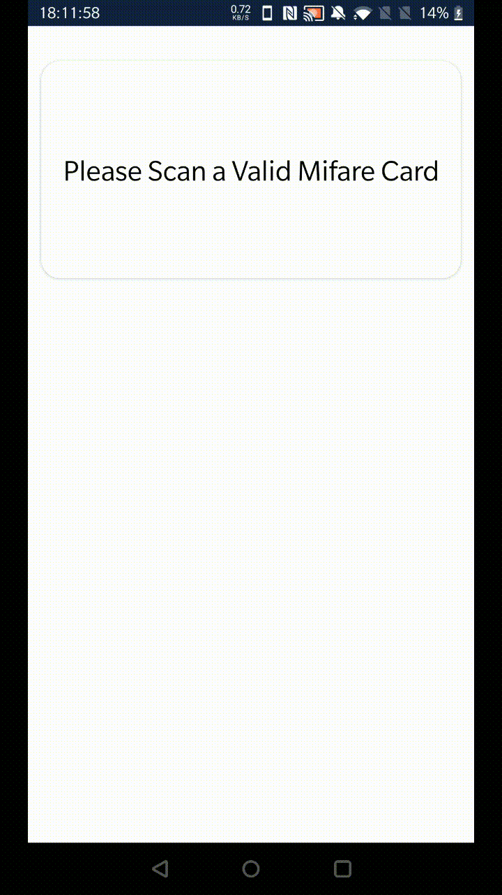

# MIFARE Cracking Android App

This repository contains the code for an Android app to analyze and manipulate MIFARE Classic cards.

Read the full blog post here: [MIFARE Cracking](https://arkandas.com/blog/mifare_classic_cracking)

For more details on MIFARE Classic cards, see the documentation folder.

